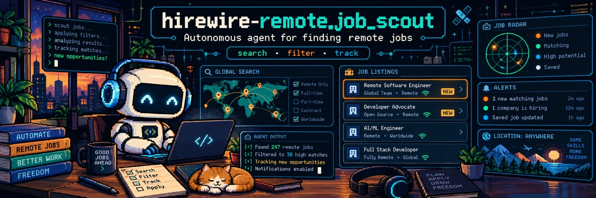
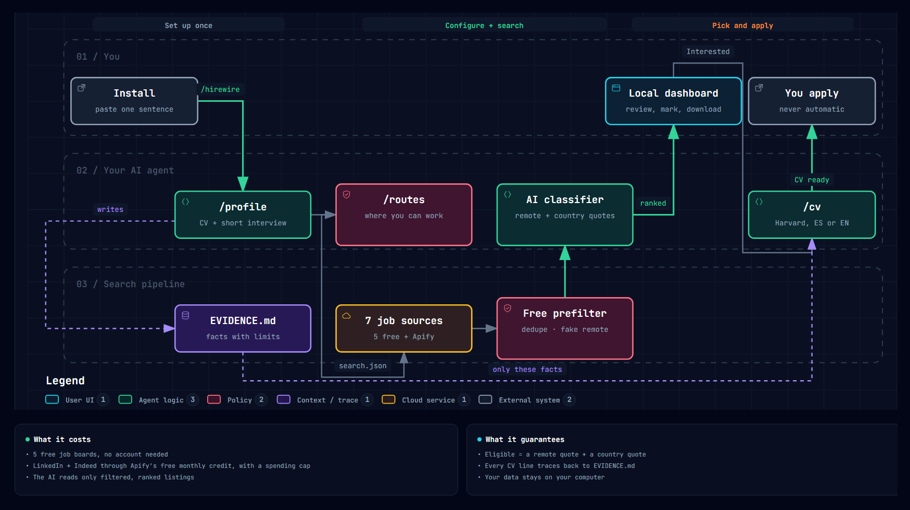
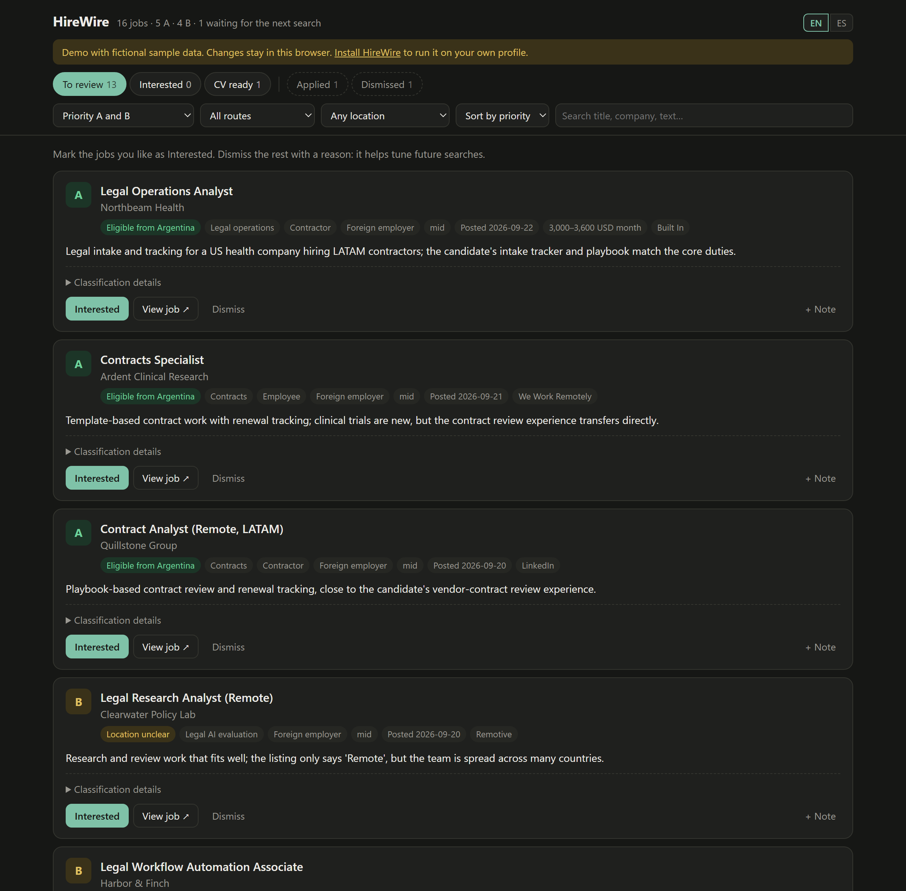

<p align="center">
  
</p>

<p align="center">
  <a href="#-getting-started"></a>
  <a href="LICENSE"></a>
  
  
</p>

<p align="center">
  <b>Find remote jobs you can <i>actually</i> take from your country, ranked against your real experience,<br>with a tailored ATS-ready CV for every one you pick.</b>
</p>

<p align="center">
  <b>English</b> · <a href="README.es.md">Español</a>
</p>

---

## 📋 Contents

- [🤔 Why HireWire](#-why-hirewire)
- [✨ How it works](#-how-it-works)
- [🖥️ The dashboard](#️-the-dashboard)
- [🚀 Getting started](#-getting-started) (about 15 minutes)
- [🧭 Everyday use](#-everyday-use)
- [💸 What it costs](#-what-it-costs)
- [🔎 Job sources](#-job-sources)
- [🛡️ What makes it different](#️-what-makes-it-different)
- [🔒 Your privacy](#-your-privacy)
- [🧰 Troubleshooting](#-troubleshooting)
- [⚙️ Under the hood](#️-under-the-hood)
- [👩‍💻 Author](#-author)

---

## 🤔 Why HireWire

Job boards are full of "remote" roles that are not remote for you:

- ❌ "Remote — US only"
- ❌ "Work from anywhere"… and then *"must be authorized to work in the United States"* in the fine print
- ❌ Hybrid or on-site roles tagged as remote

If you live outside the US or Europe, you lose hours reading listings you could never take. And when a real match finally shows up, rewriting your CV takes another hour, with the temptation to stretch the truth.

**HireWire does the reading for you.** It only shows jobs that say, in their own words, that they are remote **and** open to where you live. Then it writes an honest CV built only from facts you confirmed.

> 🙋 **You stay in control.** HireWire never applies, never sends messages and never fills in forms. It finds, ranks and prepares. You decide and apply.

---

## ✨ How it works

<p align="center">
  
</p>

<sub>Interactive version: download <a href="docs/how-it-works.html"><code>docs/how-it-works.html</code></a> and open it in your browser. Diagram made with <a href="https://github.com/tt-a1i/archify">Archify</a>.</sub>

| Step | You do | HireWire does |
| --- | --- | --- |
| **1. Profile** | Share your CV and answer a short interview (15–20 min). | Turns your experience into an **evidence bank**: each fact gets a code and a limit (what you did vs. what you took part in, tools you did *not* use). |
| **2. Routes** | Say where you live, where you can legally work and whether you accept hybrid. | Proposes 2–5 job families that fit your evidence and sets up the search: queries, filters and location rules made for **your** situation. |
| **3. Search** | Ask for a search whenever you want. | Pulls jobs from 7 sources, drops duplicates and fake-remote listings for free, and has the AI read the most relevant ones: A / B / C priority, with the exact sentence that proves you can apply. |
| **4. CV** | Mark the jobs you like and press **CV in English** or **CV in Spanish**. | Re-checks the live listing and writes a **Harvard-format CV** (DOCX + PDF) using only facts from your evidence bank. |

---

## 🖥️ The dashboard

It runs on your computer at `http://localhost:8765`. Nothing is uploaded.

<p align="center">
  
</p>

<sub>Fictional sample data. You can try the demo yourself by opening <code>web/index.html</code> through any static server.</sub>

**Flow:** To review → Interested → CV ready → Applied. When you dismiss a job you pick a reason with one click ("sales or support", "not really remote"…), and the agent can use those reasons to tune future searches.

---

## 🚀 Getting started

### What you need

| | What | Cost | Why |
| --- | --- | --- | --- |
| 🤖 | An AI coding agent: [Claude Code](https://claude.com/claude-code), [Codex](https://openai.com/codex/), [OpenCode](https://opencode.ai) or [Gemini CLI](https://github.com/google-gemini/gemini-cli) | Your current plan (free tiers work, with lower quality) | It runs the interview, reads the job listings and writes your CVs. |
| 🔑 | A free [Apify](https://apify.com) account | Free: USD 5 of credit every month | Searches LinkedIn and Indeed, with a spending cap. |
| 🐍 | Python 3.10 or newer | Free | Runs the search engine and the dashboard. **The agent checks it and helps you install it.** |

No programming knowledge is needed. You will copy and paste two things.

### Step 1 · Create your Apify account and copy your API token

The API token is a password-like key that lets HireWire run LinkedIn and Indeed searches on your free Apify credit.

1. Go to **[apify.com](https://apify.com)** and click **Sign up free**. You can sign up with Google, GitHub or an email address. No credit card is needed.
2. Once inside the Apify Console, open **Settings** in the left menu.
3. Open the **API & Integrations** tab.
4. Under **Personal API tokens**, click the **copy** icon next to your token (it starts with `apify_api_`).
5. Keep it at hand for Step 3.

> ⚠️ **Treat the token like a password.** Never paste it in a chat, an email or a public file. HireWire keeps it only in a local `.env` file that is never uploaded.

<sub>You can skip Apify and add it later: HireWire still works with its five free sources, just with fewer jobs.</sub>

### Step 2 · Install HireWire

Open your AI agent and paste this sentence:

```text
Install HireWire from https://github.com/mickybuilds/hirewire-remote_job_scout following its INSTALL.md.
```

The agent asks where to install it (suggestion: a `HireWire` folder in your Documents), downloads it, checks Python and explains the next step.

When it finishes, **open the HireWire folder in your agent**, so it can see HireWire's instructions:

| Agent | How to open the folder |
| --- | --- |
| **Claude Code** (desktop app) | Start a new session and choose the `HireWire` folder as the project. |
| **Claude Code** (terminal) | `cd` into the folder, then run `claude`. |
| **Codex** | `cd` into the folder, then run `codex`. |
| **OpenCode** | `cd` into the folder, then run `opencode`. |
| **Gemini CLI** | `cd` into the folder, then run `gemini`. |

### Step 3 · Paste your Apify token

Ask your agent: *"Open the .env file for my Apify token"*. It copies `.env.example` to `.env` and opens it. Paste your token right after the equals sign and save:

```text
APIFY_TOKEN=apify_api_xxxxxxxxxxxxxxxxxxxxxxxx
```

### Step 4 · Start

Type:

```text
/hirewire
```

In agents without slash commands, write *"start HireWire"*. From here the agent guides you through the four steps: interview, routes, first search and dashboard.

---

## 🧭 Everyday use

| You want to… | Say to your agent |
| --- | --- |
| Continue where you left off | `/hirewire` or *"what's next?"* |
| Run a new search | `/search` or *"search for jobs"* |
| Open the dashboard | *"open the dashboard"* (or run `python scripts/dashboard.py`) |
| Get a CV for a job | Press **CV in English / CV in Spanish** on the dashboard and paste the copied request |
| Fix jobs that are not really remote or not open to your country | *"I'm seeing jobs that aren't remote"*: the agent finds the pattern and tightens the rules |
| Update your experience | `/profile` |
| Change job types, country or preferences | `/routes` |

Before any LinkedIn or Indeed search, the agent tells you the spending cap and waits for your OK.

---

## 💸 What it costs

| Item | Cost |
| --- | --- |
| HireWire | Free and open source (MIT) |
| Five free job boards | Free, no account |
| LinkedIn search (via Apify) | ≈ USD 0.40 per full search |
| Indeed search (via Apify) | ≈ USD 0.05 per full search |
| Apify free plan | USD 5 of credit per month → several full searches |
| AI usage | Comes from your agent's plan. Each search classifies at most 60 listings by default, the most relevant ones, after the free filters. |

Every Apify source has a hard spending cap (`max_spend_usd`), so a search can never go over it.

---

## 🔎 Job sources

| Source | Cost | Why it's there |
| --- | --- | --- |
| [Himalayas](https://himalayas.app) | free | Remote jobs filtered by your country |
| [Built In](https://builtin.com) | free | Remote jobs with the exact list of countries allowed to apply |
| [We Work Remotely](https://weworkremotely.com) | free | Paid postings, very little spam; region per job |
| [Remotive](https://remotive.com) | free | Curated remote jobs; region per job |
| [Jobicy](https://jobicy.com) | free | Remote jobs filtered by region |
| [Get on Board](https://www.getonbrd.com) | free, optional | Tech jobs in Latin America |
| LinkedIn (via Apify) | ≈ USD 0.40 | The largest volume |
| Indeed (via Apify) | ≈ USD 0.05 | Extra volume from your national Indeed site |

Duplicates across sources are removed before the AI reads anything. After each search, the agent reports how many A and B jobs each source brought, so you can switch off the ones that don't pay off. Every job links to its original posting.

---

## 🛡️ What makes it different

- **🌎 Fake-remote detection, adapted to you.** A job is *eligible* only with two quotes from the listing: one proving it is remote and one proving it is open to where you live or can legally work. "Remote" alone is marked *unclear*. When a listing names no country, the AI reads it whole for clues ("401(k)" or "US medical plan" point to US-only; "we hire through Deel" points to international).
- **🧾 Evidence bank against invented CVs.** Every CV line must trace back to a confirmed fact, and every fact carries its own limits. Participation is never turned into leadership.
- **📄 Harvard-format CVs without AI filler.** One column, standard headings, right-aligned dates, readable by ATS filters. A banned-phrase list keeps out "passionate", "results-driven", "spearheaded" and the like.
- **💰 Cheap by design.** Free filters remove most of the noise before the AI reads anything: in real use, ~60 % of irrelevant listings with zero good jobs lost.
- **🧠 Prompt-injection aware.** Job listings are treated as data. Hidden instructions inside a listing are ignored and flagged.
- **🌐 Bilingual.** Interview, dashboard and CVs in English or Spanish.
- **📦 Zero dependencies.** Python standard library only, including the DOCX generator.

### 📊 First real run

Built for and tested by a legal professional in Argentina looking for remote work with foreign employers:

- ~1,100 listings fetched in the first search → 750 unique after removing duplicates
- 27 A/B matches, each with the eligibility sentence quoted
- **USD 0.36** of Apify credit, with a USD 1 cap

---

## 🔒 Your privacy

Everything personal stays on your computer and is excluded from Git:

| Folder / file | What it holds |
| --- | --- |
| `profile/` | Your CV, evidence bank, routes and search settings |
| `data/` | Job listings, classifications, your statuses and notes |
| `applications/` | Your tailored CVs |
| `.env` | Your Apify token |

HireWire has no server and no analytics. The only outside calls are the job sources you enable and your own AI agent.

---

## 🧰 Troubleshooting

<details>
<summary><b>"python is not recognized" / Python not found</b></summary>

Ask your agent to install Python 3.10+. On Windows it can use `winget install Python.Python.3.12`; on macOS, `brew install python`. On macOS and Linux the command may be `python3` instead of `python`, and HireWire's instructions already account for it.
</details>

<details>
<summary><b><code>/hirewire</code> does nothing or is "unknown"</b></summary>

The agent must be running **inside** the HireWire folder (see Step 2). In agents without slash commands, write "start HireWire" instead.
</details>

<details>
<summary><b>"APIFY_TOKEN missing in .env"</b></summary>

Check that the file is named exactly `.env` (not `.env.txt`), that it is in the HireWire folder, and that the line reads `APIFY_TOKEN=` followed by your token with no spaces.
</details>

<details>
<summary><b>The dashboard doesn't open</b></summary>

Another program may be using port 8765. Run `python scripts/dashboard.py --port 8766` and open `http://localhost:8766`.
</details>

<details>
<summary><b>I see jobs that are on-site, hybrid or not open to my country</b></summary>

Tell your agent, with one or two examples. It finds why they got through, tightens the rule, checks that no good job is lost and cleans the dashboard.
</details>

<details>
<summary><b>My Apify credit ran out</b></summary>

Searches keep running with the five free sources. Apify renews the free credit every month.
</details>

<details>
<summary><b>A search uses too much of my AI plan</b></summary>

Lower `max_classify_per_run` in `profile/search.json` (default: 60). The rest of the listings wait for the next search.
</details>

---

## ⚙️ Under the hood

<details>
<summary><b>Search pipeline</b></summary>

1. `fetch` queries each enabled source, removes duplicates (canonical URL and company + title) and applies free filters: excluded companies, residence or work-permit requirements for other countries, on-site or hybrid listings that never say "remote", unrelated job titles and old listings.
2. `batch` ranks the pending listings by relevance (title match, domain terms, date) and splits the top ones into batches.
3. One AI subagent per batch applies `config/criteria.md` with your profile and writes one JSON line per listing.
4. `merge` validates every line (allowed values, your route ids, a location quote for every *eligible* job) and reports errors for a retry.
5. `sources` and `test-prefilter` measure each source's yield and replay the filters against past classifications, so rules can be tuned without losing good jobs.
</details>

<details>
<summary><b>Project structure</b></summary>

```text
.claude/skills/        entry point and the four stages (/hirewire, /profile, /routes, /search, /cv)
AGENTS.md              agent instructions (CLAUDE.md and GEMINI.md import it)
INSTALL.md             installation steps the agent follows
config/criteria.md     classification rules: location, route, level, priority, output format
config/cv_style.md     CV format and writing rules
templates/             starting point for your profile files
scripts/hirewire.py    pipeline: check, fetch, batch, merge, status, sources, refilter, test-prefilter
scripts/dashboard.py   local dashboard server
scripts/make_docx.py   Markdown → Harvard-format DOCX and PDF
web/                   dashboard (local and demo mode)
docs/                  images and the interactive diagram

profile/  data/  applications/  .env     your private data, ignored by Git
```
</details>

<details>
<summary><b>Commands</b></summary>

```bash
python scripts/hirewire.py check          # validate your profile folder
python scripts/hirewire.py fetch          # free sources only
python scripts/hirewire.py fetch --with-apify   # also LinkedIn and Indeed (spends Apify credit)
python scripts/hirewire.py batch          # prepare the most relevant listings for the AI
python scripts/hirewire.py merge          # validate and store the AI results
python scripts/hirewire.py status         # where you are and what's next
python scripts/hirewire.py sources        # A/B/C yield per source
python scripts/dashboard.py               # open the dashboard at http://localhost:8765
```

You rarely need these: the agent runs them for you.
</details>

---

## 👩‍💻 Author

Made by **Micaela D. Asquini**, a tech lawyer who loves building things: AI legal solutions, legal ops and legal tech. HireWire began as her own job search.

## 📄 License

[MIT](LICENSE). Job listings belong to their publishers; HireWire links to the original postings and does not republish them.
